<p align="center">
  
</p>

<h1 align="center">Diski</h1>

<p align="center"><b>The cleanest, fastest Finder alternative for Mac.</b><br>
Everything Finder does — and the things it should have done all along — with Liquid Glass, instant folders and copies that finish before you blink.</p>

<p align="center">
  <a href="https://github.com/jordylegrand-cpu/Diski/releases/latest"><b>Download the latest alpha</b></a> ·
  macOS 26 or later · free and open source (MIT)
</p>

<p align="center">
  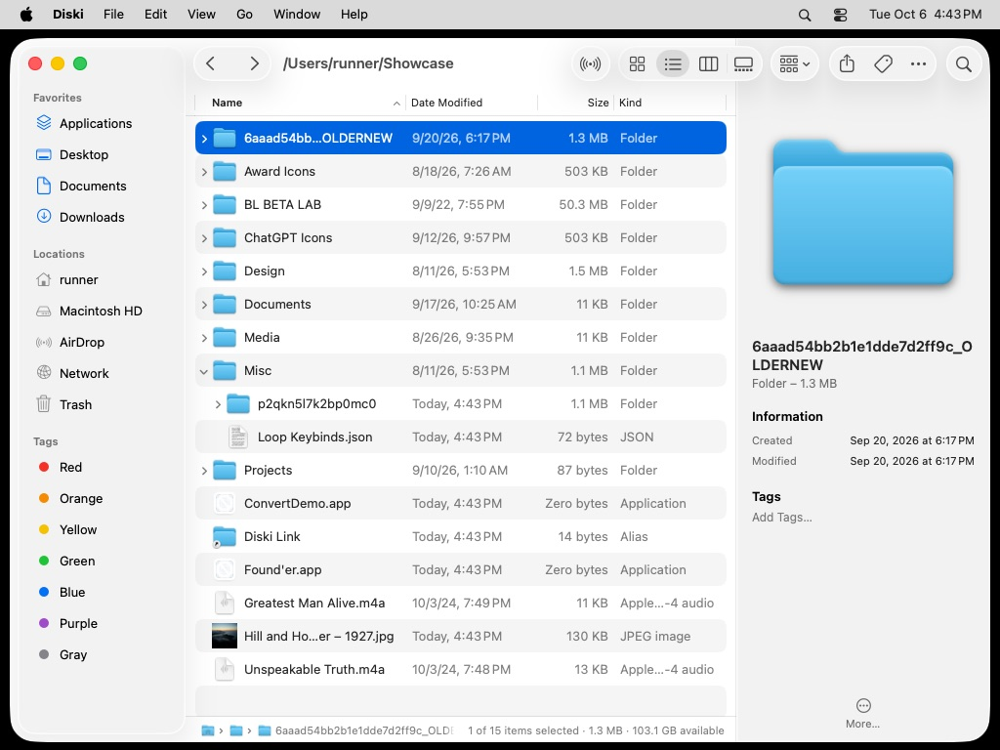
</p>

> **Alpha (0.1.2).** Diski is young: it is fast and already does a lot, but expect rough edges. Please [report issues](https://github.com/jordylegrand-cpu/Diski/issues).

## Install

1. Download **Diski-v0.1.2-alpha.zip** from the [latest release](https://github.com/jordylegrand-cpu/Diski/releases/latest), unzip it and move **Diski.app** to Applications.
2. The alpha is not notarized yet, so macOS blocks the first launch. Run this once in Terminal, then open Diski:
   ```sh
   xattr -dr com.apple.quarantine /Applications/Diski.app
   ```
3. For the Trash and other protected folders, turn on **Full Disk Access** for Diski in System Settings › Privacy & Security.

## Why it is fast

| What | How Diski does it |
| --- | --- |
| Opening a folder | `getattrlistbulk(2)` reads names, sizes, dates, flags and Finder info for a whole batch of files in **one system call** — no `NSURL` and no `stat` per file. |
| Sorting huge folders | Names are folded into compact natural-sort keys once, so sorting is plain byte comparisons instead of `localizedStandardCompare` on every comparison. |
| Going back | Listings are cached and kept current with FSEvents, so Back, Forward and tabs are instant. Refreshes merge into the existing listing: selection and open folders never jump. |
| Copying on the same drive | **APFS clones** (`clonefile`): a whole folder tree is copied copy-on-write in a single call. It takes milliseconds and uses no extra space. |
| Moving on the same drive | One `rename(2)` per item. |
| Copying between drives | No "Preparing…" phase: folders are scanned while copying starts, files stream through **parallel workers**, big files bypass the page cache, sparse files stay sparse, and metadata is applied last. |
| Folder sizes | Calculated in the background by a parallel, allocation-free scanner, shown right in the list and kept up to date while files change. |

Measured on GitHub's (virtualized) macOS 27 runner by the CI for this repository:

| | |
| --- | --- |
| Listing a folder of 3,000 files | **3.7 ms** — 6.1× faster than `FileManager` (22.6 ms) |
| Copying a 2.1 GB folder on the same drive | **0.01 s** — instant APFS clone |
| Copying the same folder to another APFS volume (a RAM disk) | **1.5 s** — 1.4 GB/s (0.96–1.4 GB/s across runs) |

Settings › Speed has a built-in speed test that compares Diski's folder reading with the system's on your Mac.

<p align="center">
  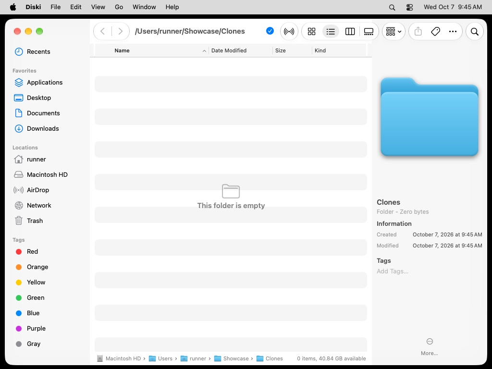
  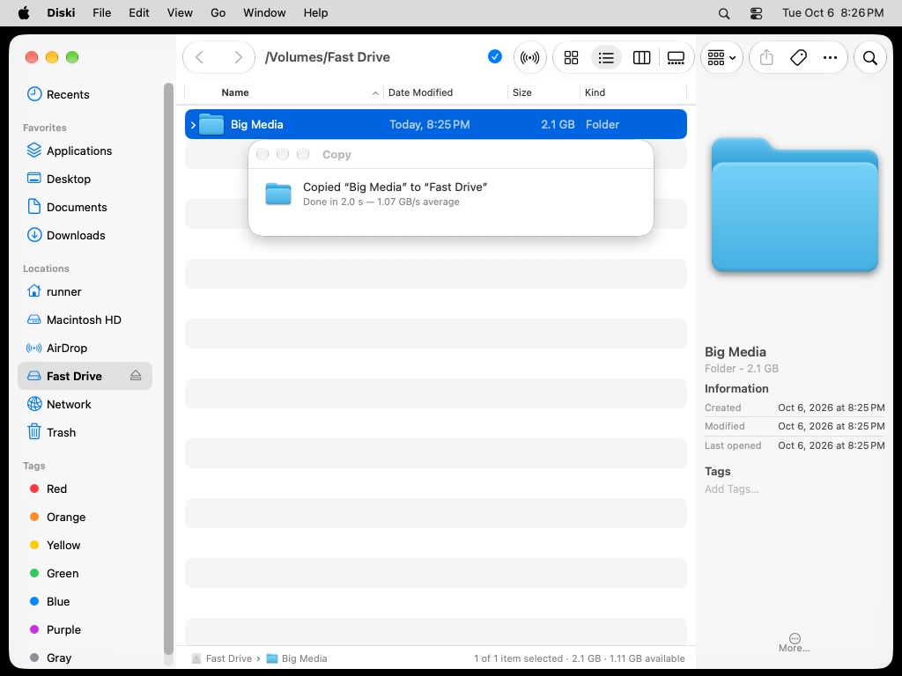
</p>

## Everything Finder does

- **Four views** — Icons, List (with inline folder disclosure), Columns, and Gallery with a live Quick Look preview and filmstrip.
- **Liquid Glass toolbar** — back/forward, AirDrop, view switcher, sort & view options, share, tags, actions and search, exactly where you expect them.
- **Sidebar** — Finder's own, edge to edge on macOS 27: Recents, Favorites (drag folders in, reorder, remove), iCloud Drive, Home, volumes with eject buttons and free-space tooltips, AirDrop, Network, Trash and Tags.
- **Preview pane** — the native inspector pane: big preview, kind & size, created / modified / last opened, dimensions, duration, editable tags, and a "More…" section with permissions, version, where-from and exact sizes.
- **Get Info** (⌘I) — a native Info window per item: General, More Info, Name & Extension (rename, hide extension), Open with (and Change All…), Preview, Sharing & Permissions, Locked and tags.
- **Path bar and item info** — clickable path, item count, selection size and free space.
- **Tabs and windows** — ⌘T / ⌘N, tab bar, merge windows; your windows, tabs and folders come back when you relaunch.
- **All the file actions** — open, open with, Quick Look, rename (Return, like Finder), duplicate, aliases, compress, tags, share, move to Trash, put back, delete immediately, empty Trash, eject, and undo for copies, moves, renames, new items and trashing.
- **Drag and drop** everywhere — between views, panes, windows, the sidebar, folders in the path bar and other apps (including file promises from Mail and Photos). ⌥ copies, ⌘ moves, ⌥⌘ makes an alias, and in the list, hovering over a folder springs it open. Drag to the Dock's Trash to delete.
- **View Options** (⌘J) — Finder's floating panel that follows the active window: sort order, Show Columns, icon size, folders on top, hidden files, folder sizes, icon previews and Use as Defaults. Date columns switch to longer formats as you widen them, like Finder.
- **Native everywhere** — the progress window, alerts, popovers, sheets and panels are the system's own AppKit components; on macOS 27 the sidebar is the new edge-to-edge one, exactly like Finder's.

## Everything Finder is missing

- **Cut & paste** that actually moves files (⌘X, ⌘V).
- **Instant filter** — start typing in the search field and the folder filters as you type; switch to *Subfolders* (a parallel scan, no index needed) or *This Mac* (Spotlight).
- **Dual pane** (⌘\\) with **F5** copy and **F6** move to the other pane, and **Tab** to switch panes.
- **Go to Folder** with live path completion and fuzzy matching on recent folders (⇧⌘G).
- **New Text File** (⌥⌘N), **Copy Path** (⌥⌘C), **Open in Terminal** (Terminal, iTerm, Ghostty or Warp), **Make Symbolic Link**.
- **Paste images and text as files** — copy a screenshot, press ⌘V in a folder, get `Pasted Image.png`.
- **Smarter conflicts** — a native alert with Keep Both, Replace, Merge, Skip or Stop, Apply to All, and both items compared ("newer", "larger"). Replaced items go to the Trash, so nothing is ever lost.
- **Progress you can trust** — Finder's Copy window with live speed, time remaining, pause/resume and stop for every operation, a progress indicator in the toolbar, and a short native confirmation for operations too quick to show a window ("Done in 0.01 s — instant APFS clone").
- **Folder sizes** in the list, hidden files with one shortcut (⇧⌘.), keep folders on top, row density, full path in the title.

## A closer look

<table>
  <tr>
    <td>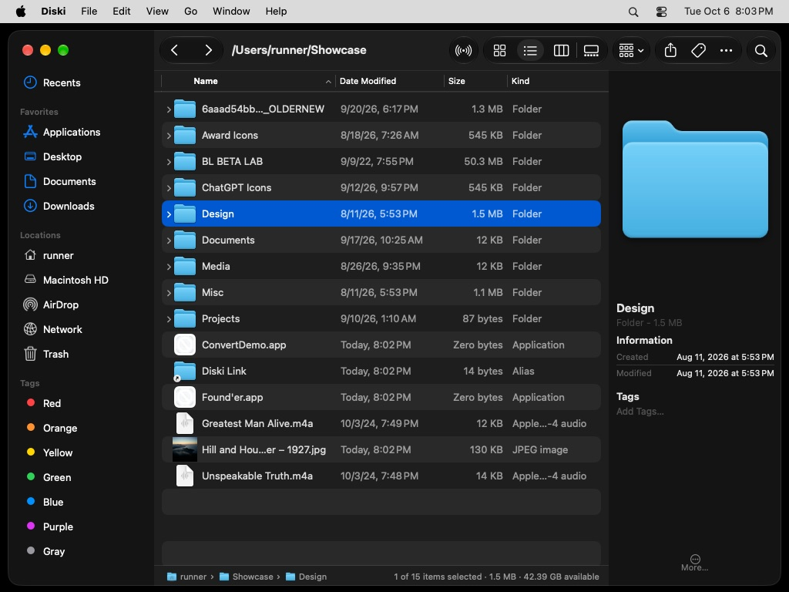<br><sub>Dark mode with folder sizes and the preview pane</sub></td>
    <td>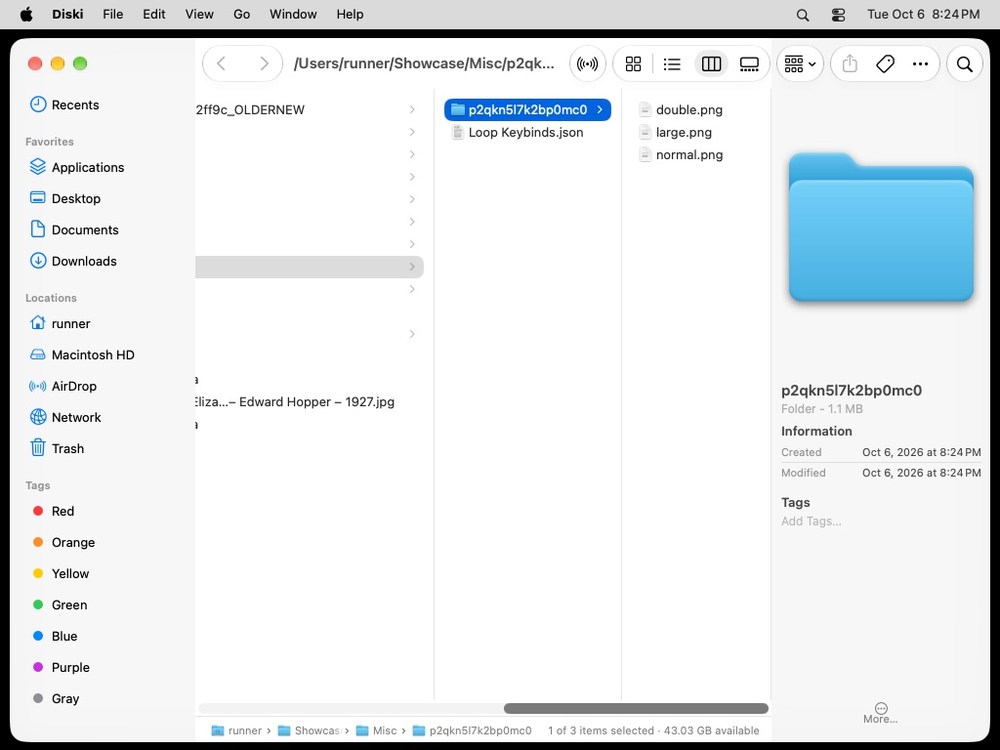<br><sub>Columns</sub></td>
  </tr>
  <tr>
    <td>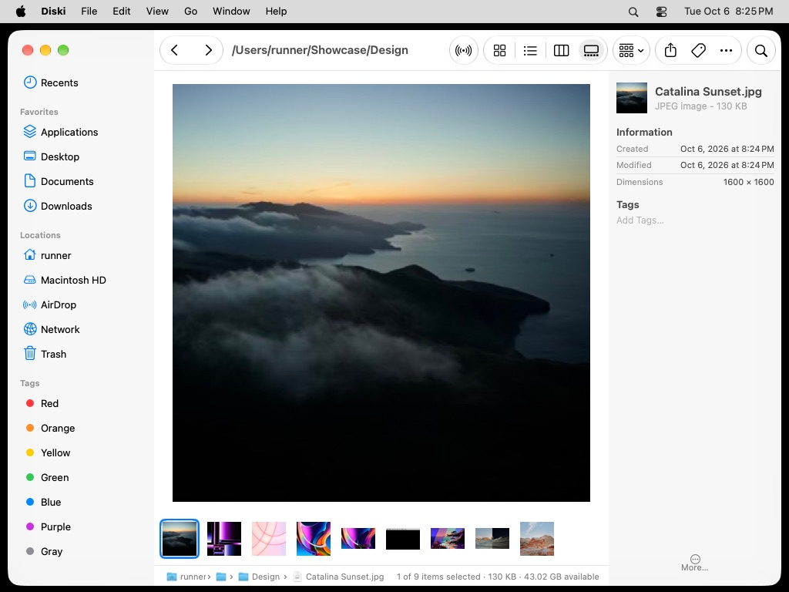<br><sub>Gallery with a live Quick Look preview</sub></td>
    <td>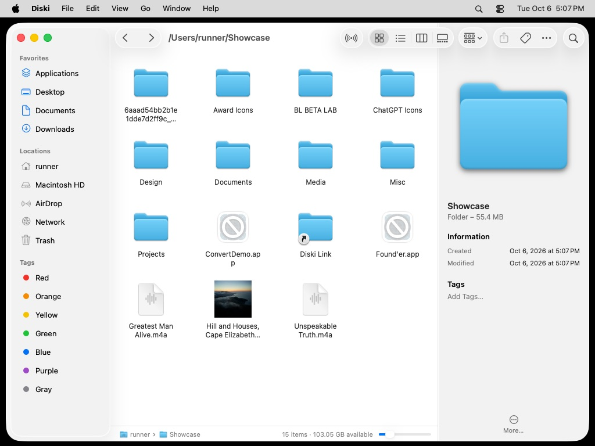<br><sub>Icons</sub></td>
  </tr>
  <tr>
    <td>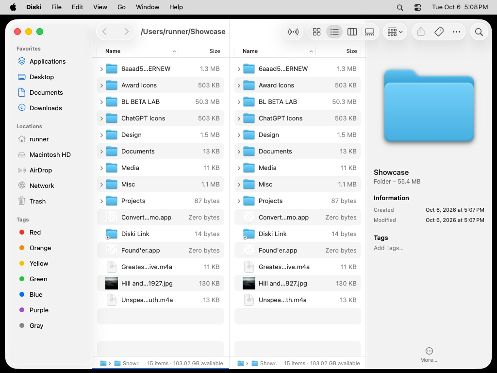<br><sub>Dual pane (⌘\)</sub></td>
    <td>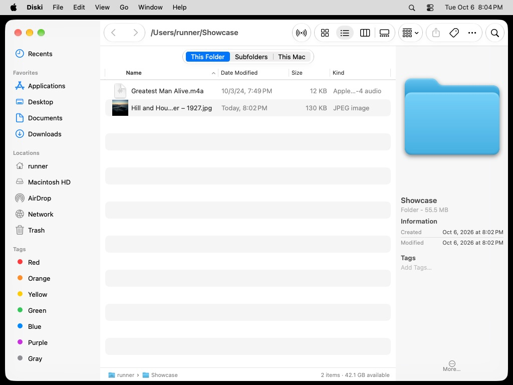<br><sub>Instant filter with search scopes</sub></td>
  </tr>
  <tr>
    <td>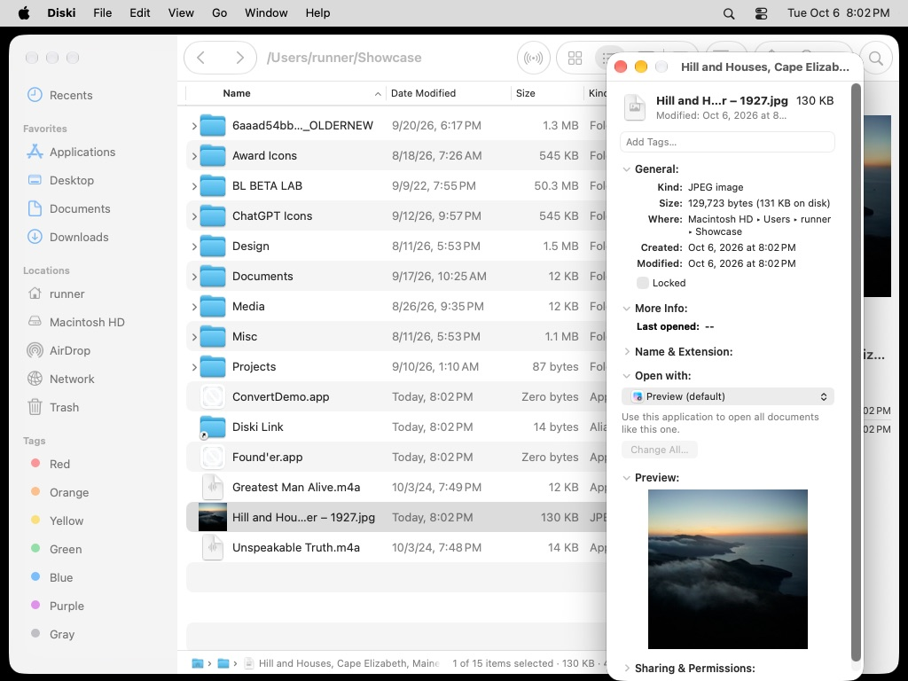<br><sub>Get Info (⌘I)</sub></td>
    <td>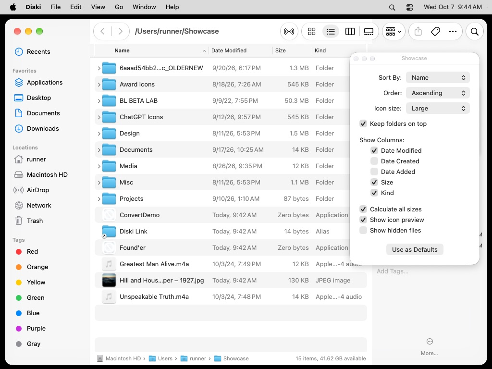<br><sub>View Options (⌘J)</sub></td>
  </tr>
  <tr>
    <td>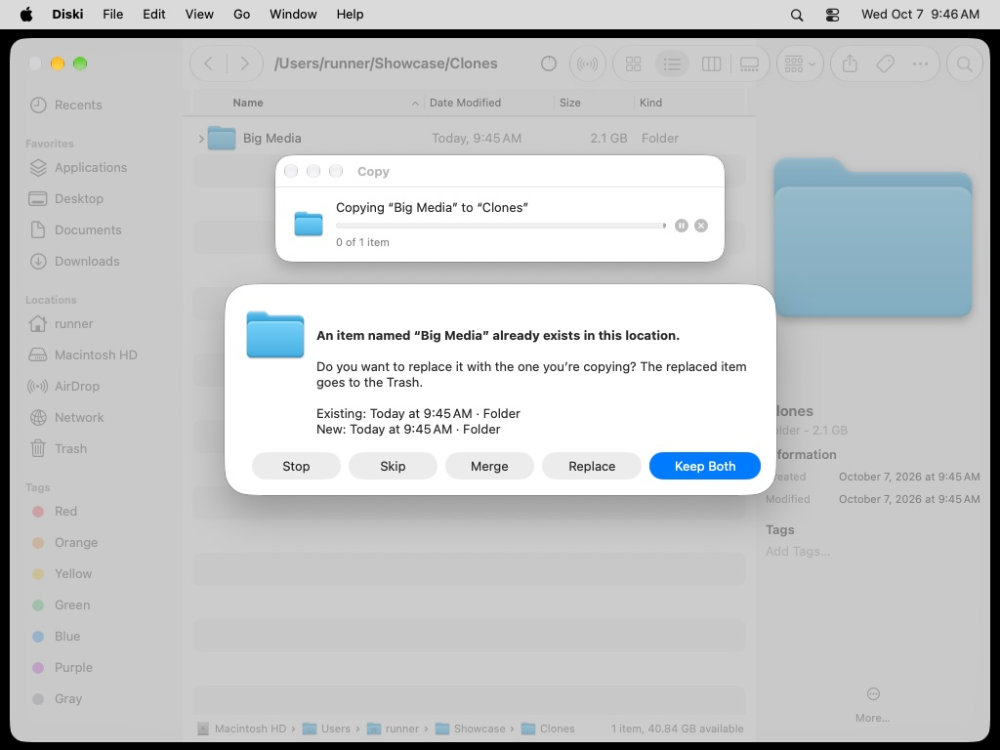<br><sub>Native conflict alert, with the Copy window behind it</sub></td>
    <td>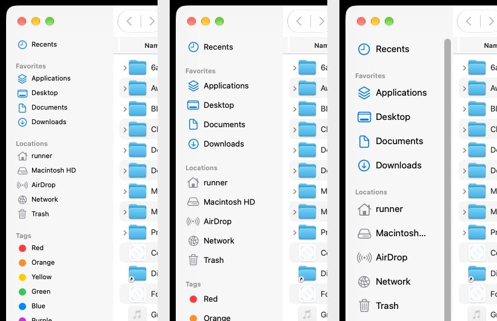<br><sub>The sidebar follows the small, medium and large sidebar sizes</sub></td>
  </tr>
</table>

## Keyboard

| | |
| --- | --- |
| ⌘[ ⌘] ⌘↑ ⌘↓ | Back, forward, enclosing folder, open |
| Return · Space | Rename · Quick Look |
| ⌘C ⌘X ⌘V ⌥⌘V | Copy, cut, paste, move here |
| ⌘D ⌘⌫ ⌥⌘⌫ ⌘Z | Duplicate, Trash, delete immediately, undo |
| ⇧⌘N ⌥⌘N ⌃⌘N | New folder, new text file, new folder with selection |
| ⌘1–⌘4 | Icons, List, Columns, Gallery |
| ⌘F ⇧⌘G ⌥⌘C ⌘J | Filter/search, go to folder, copy path, view options |
| ⌘\\ · F5 · F6 · Tab | Dual pane, copy/move to other pane, switch pane |
| ⇧⌘. ⇧⌘P ⌥⌘P ⌃⌘S | Hidden files, preview, path bar, sidebar |

Help › Diski Keyboard Shortcuts (⇧⌘/) shows the full list.

## The icon

`Diski/AppIcon.icon` is an Icon Composer document: "Midnight Glass", the Finder face on a deep indigo tile, its profile half a thick slab of periwinkle Liquid Glass with the smile seen through it. Dark, tinted and clear variants are included. Open it in Icon Composer to tweak it.

<p align="center"></p>

## Build

Requirements: macOS 26 or later, Xcode 26 or later (build with Xcode 27 for macOS 27's look).

```sh
git clone https://github.com/jordylegrand-cpu/Diski.git
open Diski/Diski.xcodeproj   # then ⌘R
```

Diski is not sandboxed (a file manager needs to see your files). The first time it opens Desktop, Documents or Downloads macOS asks for permission; for the Trash and other protected folders, turn on **Full Disk Access** for Diski in System Settings › Privacy & Security.

Every push is built with Xcode 27, tested, launched and screenshotted on a macOS 27 runner by GitHub Actions (`.github/workflows/build.yml`); the app and the screenshots are attached to each run.

## Architecture

```
Diski/
  Engine/       DirectoryReader (getattrlistbulk), DirectoryStore (cache + FSEvents), FileItem,
                NaturalSort, FileKinds, IconCache, ThumbnailCache, FolderSizer, SearchEngine, Volumes
  Operations/   CopyEngine (clone / rename / parallel copy), FileOperationManager (undo, trash,
                put back, rename, compress), progress & conflict UI
  Browser/      BrowserWindowController (toolbar, tabs, dual pane, Quick Look), PaneViewController
                (navigation, actions, drag & drop), List / Icon / Column / Gallery view controllers
  Sidebar/      Favorites, locations, volumes, tags
  Inspector/    Preview pane, Get Info windows
  Dialogs/      Go to Folder, Connect to Server, View Options panel
  Settings/     Settings window and speed test
DiskiTests/     Engine tests: listings vs FileManager, natural sort, copy correctness, conflicts, sizes
```

## License

MIT — see [LICENSE](LICENSE).
